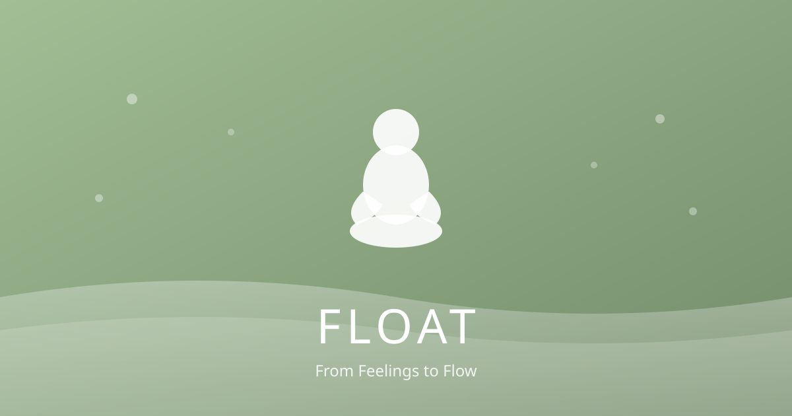

<div align="center">
<h1 align="center">
  
</h1>

<h4>
<a href="https://www.apache.org/licenses/LICENSE-2.0.html"></a>
<a href="https://expo.dev"></a>
<a href="https://ai.google.dev/"></a>
<a href="https://platform.openai.com/docs/guides/text-to-speech"></a>
<a href="https://docs.aws.amazon.com/lambda/"></a>
</h4>

<p><b>From Feelings to Flow - Personalized Meditations<br><a href="https://float.hatstack.fun">FLOAT »</a></b></p>

<p>AI turns your most stressful moments into personalized guided meditations</p>
</div>

## Structure

```text
├── frontend/   # Expo/React Native client
├── backend/    # AWS Lambda serverless API
├── docs/       # Documentation
└── tests/      # Frontend test suites
```

## Prerequisites

- **Node.js** v24 LTS
- **Python** 3.13+
- **AWS CLI** configured (`aws configure`)
- **AWS SAM CLI** for deployment

## Quick Start

```bash
npm install     # Install dependencies
npm run deploy  # Deploy backend
npm start       # Start Expo dev server
npm run check   # Run all lint and tests
```

### Frontend Environment

Create `frontend/.env` with:

```
EXPO_PUBLIC_LAMBDA_FUNCTION_URL=<your-api-url>
EXPO_PUBLIC_WEB_CLIENT_ID=<your-google-oauth-client-id>
```

The `EXPO_PUBLIC_WEB_CLIENT_ID` is required for Google Sign-in on web. Get it from [Google Cloud Console](https://console.cloud.google.com/apis/credentials) → OAuth 2.0 Client IDs → Web application.

## Deployment

```bash
npm run deploy
```

Deploys the backend Lambda using AWS SAM. Configuration in `backend/samconfig.toml`.

| Parameter | Description |
|-----------|-------------|
| `GeminiApiKey` | Google Gemini API key |
| `OpenAIApiKey` | OpenAI API key |
| `ProductionOrigins` | Comma-separated allowed origins for CORS (e.g., `https://float-app.fun`) |

See [docs/README.md](docs/README.md) for full documentation.

## License

Apache 2.0
