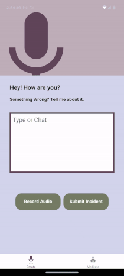

# Float

Float is a cross-platform meditation app built with React Native and Expo. It uses Google Generative AI, Eleven Labs text-to-Speech (migrating to Google TTS), and a library of sound files to create personalized meditation experiences based on user-submitted incidents that have affected them emotionally, which we refer to as "floats". Floats are categorized by emotion and intensity, and include a timer and a color scheme to indicate the duration, summary, and reasoning behind each meditation. The app can generate meditations from up to three floats at a time.

## Web Demo



[Float Web Demo](https://float-app.fun)

[Youtube](https://www.youtube.com/watch?v=8hmrio2A5Og)

## Features :zap:

- **Personalized Meditations**: Generates customized meditation sessions based on user-submitted floats.
- **Multi-Platform Support**: Built with React Native and Expo, supporting iOS, Android and Web platforms.
- **Create Floats with Audio and Text**: User can create floats with audio or text allowing Gemini to capture tonality and speech patterns to asses mood and intensity of emotion as well as text
- **Google Generative AI Integration**: Utilizes Google Generative AI for generating floats and meditation content.
- **ElevenLabs Text-to-Speech**: Converts generated text into spoken meditations using ElevenLabs' text-to-speech technology.
- **Color-Coded Timer**: Provides a visual timer with a color scheme to indicate the elapsed time of the meditation session.
- **Emotion and Intensity Categorization**: Categorizes floats by emotion and intensity to tailor meditation experiences.
- **Backend Powered by AWS Lambda**: Manages API calls to Google Generative AI and ElevenLabs through AWS Lambda functions.

# Installation :eyes:

To set up and run Float locally, follow these steps:

### Prerequisites

- Node.js (version 14 or higher)
- Expo CLI (install with `npm install -g expo-cli`)
- A Google Cloud account with API access for Generative AI
- An ElevenLabs account with API access for Text-to-Speech
- OpenAI Account and API key
- AWS account with Lambda functions set up

### Clone the Repository

```bash
git clone https://github.com/yourusername/float.git
cd float
```

### Install Dependencies
```bash
yarn
```

## Configure Environment Variables
Create a .env file in the root directory and add the following variables:

Frontend
```bash
EXPO_PUBLIC_AWS_ID=<aws_id>
EXPO_PUBLIC_AWS_SECRET=<aws_secret>
EXPO_PUBLIC_AWS_REGION=<aws_region>
```

Backend
```bash
FFMPEG_BINARY=/opt/bin/ffmpeg
G_KEY=<google_api_key>
SIMILARITY_BOOST=0.7
STABILITY=0.3
STYLE=0.3
VOICE_ID=jKX50Q2OBT1CsDwwcTkZ
XI_KEY=<eleven_labs_key>
OPENAI_API_KEY=<openai_key>
```

# Run the App :smile:

### Frontend

Start the development server:

```bash
npm start -c
```
This will open the metro builder. You can run the app on iOS, Android, or web

### Backend

Create a Lambda Layer for the FFMPEG subprocess.  Thanks to [SARVESH VIRKUD](https://virkud-sarvesh.medium.com/building-ffmpeg-layer-for-a-lambda-function-a206f36d3edc)

The Lambda packages need to be downloaded and built on a Linux machine with python 3.12 for google.protbuf and crypto binary packages to work correctly 

## Usage

- **Add Floats:** Enter incidents with audio or text that have affected you.
- **Review:** Review the summary and reasoning behind the float-generation. 
- **Timing:** Use the color-coded timer to monitor if enough temporal space has been created.
- **Generate Meditation:** Select up to three floats to create a personalized meditation.
- **Start Meditation:** Begin the meditation session. 

## API Integration :fire:

- **Google Generative AI:** Used for generating the content of the meditations.
- **AWS Lambda:** Manages API calls and processes data from Google and ElevenLabs APIs.

**Choice of Voice API:** Converts generated text into audio for the meditation sessions.
- **ElevenLabs** 
- **Google TTS**
- **OpenAI Text-to-Speech**


## License
This project is licensed under the Apache 2.0 License. See the LICENSE file for details.

## Acknowledgements

**Google Icons:** Material Icons provided by Google Material Icons

**Logo Font:** Font provided by notyourtypefoundry testType(1.1)

## Contact
For questions or feedback, please contact:

- Email: gemenielabs@gmail.com
- GitHub: https://github.com/hatmanstack
- Twitter: @hatmanstack

Enjoy your meditative journey with Float!

